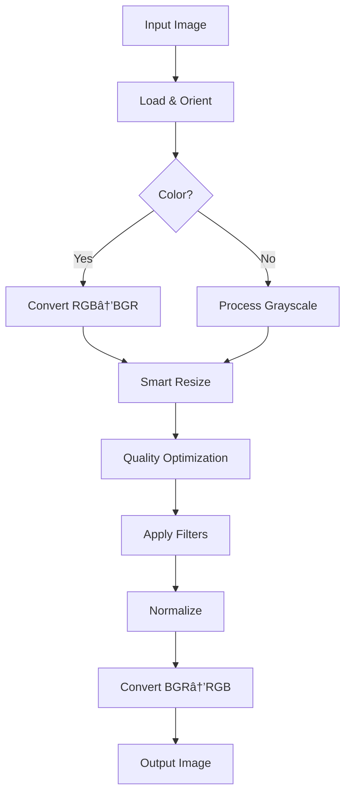

## Started at 12 am 31st May.
# Task:Multi-Modal Content Moderator (Image & Text) (Mid Weightage in Evaluation)

# Overview

**A multi-agent system for detecting NSFW and toxic content in text & images.**

### **Agents**

1. **Main Agent** (Llama3-70B)
    - Orchestrates moderation flow
    - Generates final reports & summaries
2. **NSFW Agent** (Google Vision API)
    - Detects explicit/suggestive images
    - Flags nudity, violence, and graphic content
3. **Toxicity Agent** (Llama3-70B)
    - Identifies hate speech, harassment, and toxic text
    - Analyzes context for nuanced language

### **How It Works**

1. User submits text/image
2. Main Agent routes content to appropriate detectors
3. NSFW Agent scans images, Toxicity Agent checks text
4. Main Agent compiles results and returns a moderation decision

## Built using

- Frontend: Next.js
- Backend: FastAPI
- Infrastructure: Groq AI for fast inference.


# Plan

### Core Components

- **Frontend Interface**: React-based web application for content upload and results display
- **Backend API**: Fast API server handling content processing
- **Image Analysis Pipeline**: NSFW detection + OCR extraction
- **Text Analysis Pipeline**: Toxicity, hate speech, and PII detection
- **Decision Engine**: Aggregates results and provides safety verdicts

# Functioning of AI Agent

1. **Image/Text Input**: The system receives an image for analysis.
2. **AI Analysis Pipeline**:
    - **OCR Processing**: An OCR agent extracts all text from the image
    - **Content Safety Check**: A NSFW detection agent scans for inappropriate visual content
    - **Text Toxicity Analysis**: If text is found or input was text, a toxicity agent evaluates it for offensive language, slurs, or harmful content
3. **Result Compilation**: The system combines findings from all checks into a comprehensive safety report
4. **Final Review**: A master LLM agent synthesizes the data into a clear, human-readable summary indicating:
    - Overall safety status (Safe/Unsafe)
    - Specific reasons for any unsafe classification
    - Excerpts of problematic content (when applicable)
5. **Output Delivery**: The finalized safety assessment is returned to the user.


# Components of the Project

# Main Agent

The main agent is responsible to call the other agents like the OCR, NSFW and Toxicity agent to check the images and text for NSFW content and also prepare a summarized report from the analysis data that it gets from all agents.

It does this by using the Mistral model with relevant context to suummarize and reason for the conent being NSFW and also highlight words which fall under NSFW or catrgory of NSFW for the case of images.

## OCR Recognition

- We let tesarract library choose the best model for the task. (mostly LSTM neural nets)
- We choose to process text in images as single text columns or blocks which is best for the case of dealing with images.

# NSFW Agent

- We used Google Vision API’ Safe Search capability to detect NSFW content. Below listed are its key features:
1. **Safe Search Detection**
    
    The primary feature for detecting NSFW content is **Safe Search**, which categorizes images based on the likelihood of containing:
    
    - **Adult content** (nudity, sexual activity)
    - **Violence** (graphic or disturbing violent scenes)
    - **Medical content** (blood, injuries, medical procedures)
    - **Spoof content** (parody, fake, or manipulated media)
    - **Racy content** (provocative or suggestive imagery)
2. **Confidence Scoring**
    
    Each category is assigned a confidence score (**`VERY_UNLIKELY`**, **`UNLIKELY`**, **`POSSIBLE`**, **`LIKELY`**, **`VERY_LIKELY`**), allowing you to set thresholds for filtering.
    
3. **Multi-Format Support**
    
    Works with JPEG, PNG, GIF, BMP, and WEBP images, as well as frames from videos.
    
4. **Integration with Google Cloud**
    
    Can be used alongside other Google Cloud services like **Cloud Storage, AutoML Vision**, or **Vertex AI** for custom models.
    

# Toxicity Agent

- Toxicity Agent is the agent responsible to find offensive text content on the basis of given categories below:
    1. Explicit profanity
    2. Hate speech
    3. Threats
    4. Sexual content
    5. Harassment

- We used Langchain to create a single chain to take Llama LLM model(llama3-70b) through Groq API with context prompt set as per the use case and we get the results in json format which we reconcile with other result from model to generate a overall report.

# Problems I faced during project

## Image Recognition and Object Detection

While the Google’s Vision API is doing a very good job with detect NSFW images, in some cases it is not able to infer the correct category of NSFW content and also object detection is also not working as good as I expected to and at times not able to detect objects in the image.

Hence, i figured I should work on doing some image preprocessing before sending to the Cloud Vision, here’s what I have listed till now to do:

1. Compress very high resolution images for saving cost.😅
2. Improve blurry ,very low res and darker images using OpenCV.

## Reference

- https://www.philippe-fournier-viger.com/dspr/dspr32-1.pdf
- https://ieeexplore.ieee.org/stamp/stamp.jsp?tp=&arnumber=10510278

## Pipeline Steps

This pipeline automatically prepares images for computer vision tasks by:

1. **Smart Resizing**
    - Makes images smaller if needed (but never stretches them)
    - Keeps the original proportions intact
2. **Quality Enhancement**
    - Improves brightness and contrast automatically
    - Makes details sharper without looking unnatural
3. **Noise Reduction**
    - Cleans up graininess and small imperfections
    - Preserves important edges and textures
4. **Automatic Corrections**
    - Fixes rotated photos (using the camera's orientation data)
    - Works for both color and black-and-white images
5. **Standardized Output**
    - Ensures all images have consistent quality
    - Prepares them perfectly for AI analysis



## Inference and Deployment

Initally I was running the Llama model locally on my machine when using it and the problem was that my computer not being a super computer with good amount of GPU and RAM, the inferences from the model were taking almost a minute which would also be the case when I decide to deploy on a lambda or a normal web server or else i need to configure a very powerful server(EC2 preferbly) with good GBs of RAM and a powerful GPU.

VERY COSTLY AND TIME CONSUMING TO DEPLOY!!

Hence, with some research, I came across Groq AI - A Fast AI inference Library where they have custom hardware with all the popular open source models hosted on them and provide a simple API interface using SDKs or direct API links to use these models and get inferences in much low latency and high throughput( sometimes getting responses in 100ms).

I am yet to plan for deploying on a server.

# Backend Dev Setup

This guide will help you set up the FastAPI backend server with pytesseract OCR capabilities.

## Prerequisites

- Python 3.8 or higher
- Git
- Tesseract OCR engine

## Step 1: Install Tesseract OCR

### Windows
1. Download Tesseract installer from [GitHub releases](https://github.com/UB-Mannheim/tesseract/wiki)
2. Run the installer and note the installation path (usually `C:\Program Files\Tesseract-OCR`)
3. Add Tesseract to your system PATH or note the path for later configuration

### macOS
```bash
# Using Homebrew
brew install tesseract

# Using MacPorts
sudo port install tesseract
```

### Ubuntu/Debian
```bash
sudo apt update
sudo apt install tesseract-ocr
sudo apt install libtesseract-dev
```

### CentOS/RHEL/Fedora
```bash
# CentOS/RHEL
sudo yum install tesseract tesseract-devel

# Fedora
sudo dnf install tesseract tesseract-devel
```

## Step 2: Clone the Repository

```bash
git clone <your-repository-url>
cd <your-repository-name>
```

## Step 3: Navigate to Backend Directory

```bash
cd backend
```

## Step 4: Create Virtual Environment

```bash
# Create virtual environment
python -m venv venv

# Activate virtual environment
# Windows
venv\Scripts\activate

# macOS/Linux
source venv/bin/activate
```

## Step 5: Install Dependencies

```bash
pip install -r requirements.txt
```


## Step 6: Configure Tesseract Path (Windows Only)

If you're on Windows, you may need to specify the Tesseract path in your code:

```python
import pytesseract

# Add this line with your actual Tesseract installation path
pytesseract.pytesseract.tesseract_cmd = r'C:\Program Files\Tesseract-OCR\tesseract.exe'
```


## Step 8: Run the FastAPI Server

```bash
# Basic run
uvicorn main:app --reload

# Run with custom host and port
uvicorn main:app --host 0.0.0.0 --port 8000 --reload
```

The server will be available at:
- Local: http://127.0.0.1:8000
- Network: http://0.0.0.0:8000
- API Documentation: http://127.0.0.1:8000/docs


# Next.js Frontend Setup Guide

This guide will help you set up the Next.js frontend application for the project.

## Prerequisites

- Node.js 18.17 or higher
- npm, yarn, pnpm, or bun package manager
- Git

## Step 1: Check Node.js Installation

```bash
# Check Node.js version
node --version

# Check npm version
npm --version
```

If Node.js is not installed, download it from [nodejs.org](https://nodejs.org/).

## Step 2: Navigate to Frontend Directory

```bash
cd frontend
```

## Step 4: Install Dependencies

Choose your preferred package manager:

### Using npm
```bash
npm install
```


## Step 5: Run in Developement server
### Using npm
```bash
npm run dev
```
## Step 6: Update the Environment Variables

- Create a `.env.local` file(sample given to copy)

- Then change the API_URL to the URL of the locally running backend service.